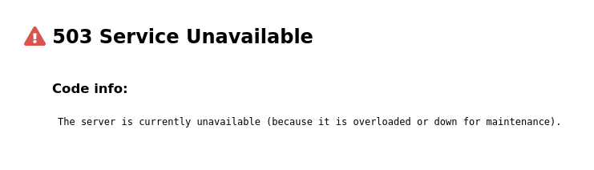

# error-pages

## Description

A simple to use generator for **static pages with errors** to replace the default error pages that come with any web server like **Nginx** or **Apache**.

## Use example

Then an example of starting the tool:

``````
./httpgen
``````

## Error examples

### 404 Not Found


### 503 Service Unavailable


### Temporary Maintenance


### Rate Limit


## Contributing

See [CONTRIBUTING.md](CONTRIBUTING.md).

## Project architecture

    |-- LICENSE.md                    # GNU GENERAL PUBLIC LICENSE, Version 3, 29 June 2007
    |-- README.md                     # this simple documentation
    |-- CONTRIBUTING.md               # principles of project support
    |-- .gitignore                    # ignore untracked files
    |-- httpgen                       # main script (init)
    |-- sites                         # store generated static pages (default empty)
    |-- src
        |-- 4xx.json                  # data for 4xx errors
        |-- 5xx.json                  # data for 5xx errors
        |-- main.css                  # main css file for all static pages
        |-- templates
            |-- _rate-limit.html      # static page for rate-limit error
            |-- _invalid-domain.html  # static page for invalid-domain error
            |-- _maintenance.html     # static page for maintenance page
            |-- _template.html        # static page for all other errors (eg. 404, 500)
            |-- nginx
                |-- errors.conf       # config file with error directives

## License

GPLv3 : <http://www.gnu.org/licenses/>

**Free software, Yeah!**
